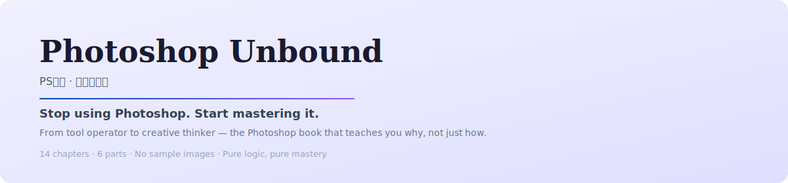

<p align="center">
  <picture>
    <source media="(prefers-color-scheme: dark)" srcset="assets/banner-dark.svg">
    
  </picture>
</p>

<p align="center">
  <strong>PS无界 · 无图实战版</strong>
</p>

<p align="center">
  <em>Stop using Photoshop. Start mastering it.</em>
</p>

<p align="center">
  <a href="#"></a>
  <a href="#"></a>
  <a href="#"></a>
  <a href="https://ps.404w.com"></a>
  <a href="LICENSE.md"></a>
</p>

---

## 🚀 What is Photoshop Unbound?

**Photoshop Unbound** (PS无界) is not your typical Photoshop tutorial. This book takes a radically different approach:

> **No sample images. No step-by-step copy-paste. Pure logic, pure mastery.**

It teaches you **why** Photoshop works the way it does, not just **how** to click buttons. Built around **6 parts across 14 chapters**, it transforms you from a tool operator into a creative thinker.

### Core Philosophy

```
┌──────────────────────────────────────────────────────────┐
│          Photoshop Unbound Four-Step Method              │
├──────────────────────────────────────────────────────────┤
│                                                          │
│   1️⃣ Mind  →  2️⃣ Structure  →  3️⃣ Control  →  4️⃣ Create │
│                                                          │
│   • Non-Destructive   • Layer Stacking  • Selections    │
│   • Reversible        • Blending Modes  • Masks         │
│                                                          │
└──────────────────────────────────────────────────────────┘
```

---

## 📚 Table of Contents

### Part 1: Mindset & Foundation (Chapters 1-2)
> Sharpen your axe before cutting the tree

- **Ch 1**: The Nature of Photoshop — Digital image fundamentals (pixels, resolution, color depth)
- **Ch 2**: Non-Destructive Editing — The art of being able to undo

### Part 2: Structure & Recomposing (Chapters 3-4)
> Command the skeleton of your image

- **Ch 3**: Layer Philosophy — The mille-feuille of creativity
- **Ch 4**: Pixel Alchemy — Blending Mode deep logic

### Part 3: Control & Selections (Chapters 5-7)
> Precision local surgery

- **Ch 5**: Selection Logic — Specifying the scope of operations
- **Ch 6**: Pen Tool — The pinnacle of vector precision
- **Ch 7**: Mask — The art of reveal and conceal

### Part 4: Light & Color (Chapters 8-10)
> Give your image a soul

- **Ch 8**: Color Grading Logic — Visualizing data
- **Ch 9**: Filters & Plugins — Standing on giants' shoulders
- **Ch 10**: Camera Raw AI Masks & Light Re-painting

### Part 5: Brushes & Fine Control (Chapters 11-12)
> The ultimate polish of texture and detail

- **Ch 11**: Opacity vs. Flow — The ultimate guide
- **Ch 12**: Why 100% Opacity + Low Flow in Mask?

### Part 6: Efficiency & Evolution (Chapters 13-14)
> From craftsman to factory manager

- **Ch 13**: Actions & Batch — The power of automation
- **Ch 14**: Continuous Growth & Resource Library

### Appendices
- **A**: Common Mistakes Correction Manual
- **B**: PS Terminology Quick Reference
- **C**: Keyboard Shortcuts Quick Reference
- **D**: FAQ

---

## 🎯 Who Is This For?

| You are... | This book will help you... |
|------------|---------------------------|
| 🎨 A photographer | Master retouching logic for better, faster edits |
| 💻 A designer | Build a complete image processing mental framework |
| 📱 A content creator | Create high-quality visuals with confidence |
| 🌱 A beginner | Skip the frustration of blind click-by-click tutorials |
| 🚀 An intermediate user | Break through plateaus and reach professional level |

---

## 🌟 What Makes This Book Unique?

1. **🧠 Logic First** — Not "click here", but "why click here"
2. **⚡ Mindset Before Technique** — Teach fishing, not fish
3. **🔧 Practice-Driven** — Every concept maps to real scenarios
4. **📈 Thinking Upgrade** — From "can operate" to "can think"
5. **📝 Image-Free** — Detailed text guides every step, no visuals needed

---

## 🛠️ Tech Stack

This book is published as a [GitBook](https://www.gitbook.com)-compatible Markdown site, deployed via GitHub Pages:

```
📁 .github/workflows/ → Jekyll build & deploy
📁 _layouts/          → Page templates
📄 *.md               → Chapter markdown files
📄 _config.yml        → Jekyll configuration
📄 index.md           → Landing page
📄 SUMMARY.md         → Sidebar navigation
```

**Live site**: [ps.404w.com](https://ps.404w.com)

---

## 📖 How to Use This Book

### Beginners (Parts 1-5)
Follow sequentially from foundation to advanced:

```
Week 1 │ Ch 1-2  Core mindset & concepts
Week 2 │ Ch 3-4  Layers & Blending Modes
Week 3 │ Ch 5-7  Selections, Pen Tool, Masks
Week 4 │ Ch 8-10 Color grading & Filters
Week 5 │ Ch 11-12 Fine brush control
```

### Advanced (Parts 6 + Appendices)
After foundation, dive into production workflows:

```
Week 6 │ Ch 13-14 Automation & resource management
Week 7 │ Appendices Review & reference
```

> **Pro tip**: Read with Photoshop open. Follow the steps. Use YOUR photos, not case studies.

---

## 🌍 Languages

| Language | File | Status |
|----------|------|--------|
| 🇨🇳 简体中文 | `*.md` (source) | ✅ Complete |
| 🇬🇧 English | `*_EN.md` | ✅ Complete |

---

## 📄 License

© 无忌视觉 · PS无界

This work is licensed under **Creative Commons Attribution-NonCommercial-NoDerivatives 4.0 International**. See [LICENSE.md](LICENSE.md).

---

<p align="center">
  <strong>Start your Photoshop mastery journey today.</strong><br>
  <em>Remember: Technology is just a means. Creativity is the end.</em>
</p>
